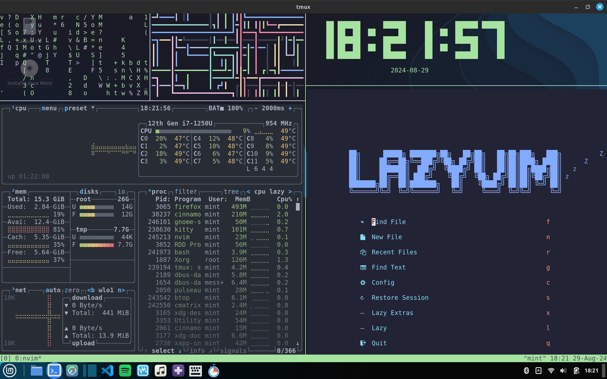
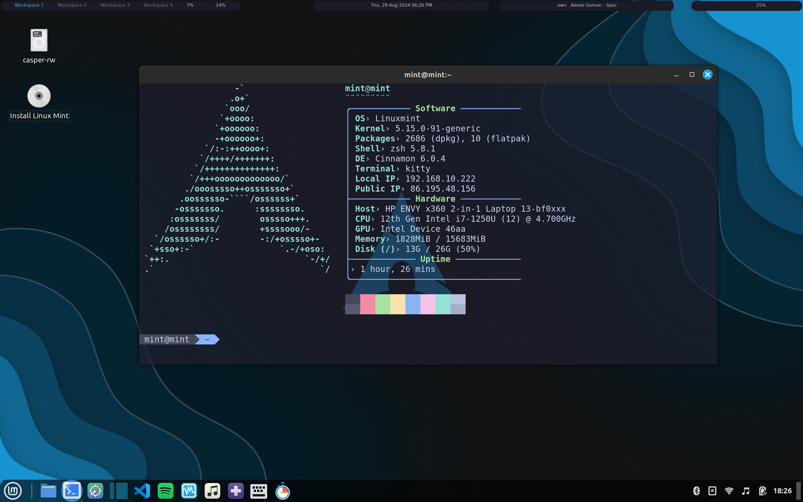
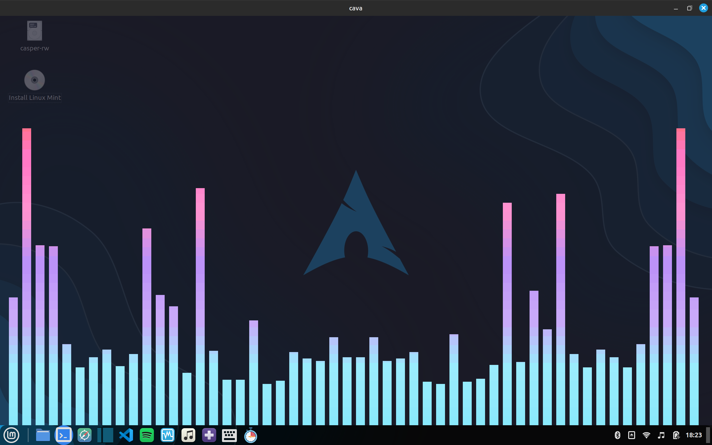
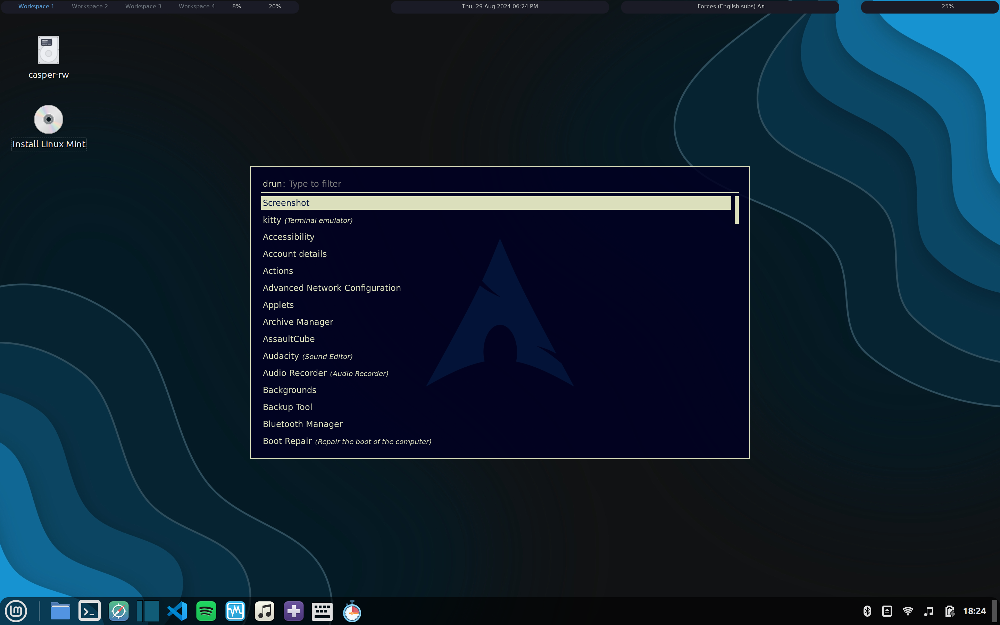
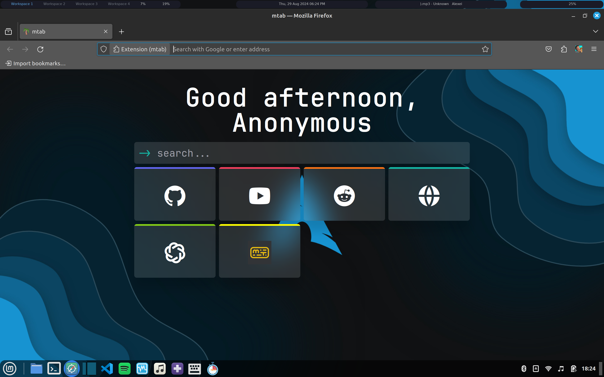

# mint-rice
[Cinnamon] My Linux Mint rice

OS: Linux Mint
DE: Cinnamon
WM: Mutter

Table of Contents
-- .config
-cava configuration
-neofetch configuration
-kitty terminal configuration
-polybar configuration

-- software
-list.txt >> list of the software I use on my system

-- screenshots

main

wallpaper

neofetch

cava

polybar

firefox
